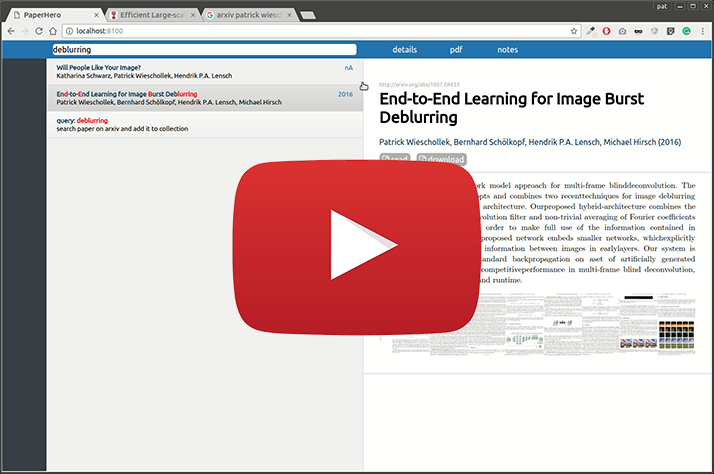

# Manager for PDF papers (Arxiv-Binding)

Tired of browsing directories of pdfs?

This small and hackable applications allows you to store your pdfs locally on your server or desktop pc. It just needs **Python2.7**. There is no database! It is more or less a rewrite of my [old implementation](https://github.com/PatWie/papershelf).

Features:
- download papers directly from Arxiv including meta data
- fuzzy search your local papers
- paper-preview generator

[](https://www.youtube.com/watch?v=vVOzSyECiSE "PaperHero - click to watch")

## Install locally
````bash
    # get montage command
    sudo apt-get install imagemagick imagemagick-doc
    cd /var/www/papers
    git clone https://github.com/PatWie/paperhero.git
    cd paperhero
    pip install -r requirements.txt --user
    python2.7 compile.py # compile sass and minify js
    # ready to start
    python2.7 paperhero.py --port 8888
````

Now point your browser to http://localhost:8888

## Install on your VirtualPrivateServer (VPS)

I assume you already have NGINX properly configured and running. An example config file is given in [docs](docs). This uses NGINX for serving static assets and as a reverse-proxy for the python app itself.
````bash
    # get montage command and utils for htaccess
    sudo apt-get install imagemagick imagemagick-doc apache2-utils
    cd paperhero 
    sudo htpasswd -c .htpasswd <username>
    # make directoy writeable by current user
    sudo chown -R your-user:your-user .
    sudo cp docs/paperhero.conf /etc/nginx/sites-available/paperhero.conf
    # edit (server-name, path, port)
    sudo nano /etc/nginx/sites-available/paperhero.conf
    # activate site
    sudo ln -s /etc/nginx/sites-available/paperhero.conf /etc/nginx/sites-enabled/
    # start app (in another terminal)
    python2.7 paperhero.py --port 8100&
    sudo service nginx reload
````


## Stop app
````bash
    ps aux | grep [p]aperhero
    kill ....
````


