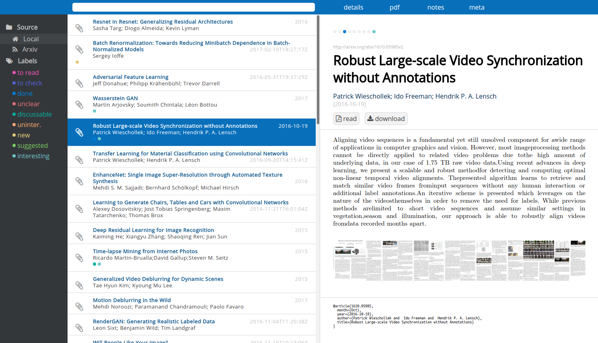

# Manager for PDF papers (Arxiv-Binding)

Tired of browsing endless directories of pdfs? Arxiv is again slow when loading a paper?

This small and hackable web-app written in python which allows you to browse your pdf collection in a nice interface. 

Features:
- search and download papers directly from Arxiv.org including meta data such as title, authors and abstract
- live fuzzy-search your local papers
- add notes with markdown and LaTeX
- edit meta-data
- use labels

Each entry consists of up to 4 files:
- .pdf: the article itself
- .yml: all meta data, which can be exported later to bibtex
- .jpg: a small preview of all papes
- .md (optional): notes in markdown-format

This allows you to synchronize your papers across different machines quite easily even without a git-repository.



## Install locally
````bash
    # get montage command
    sudo apt-get install imagemagick imagemagick-doc
    # clone this project
    cd /var/www/papers
    git clone https://github.com/PatWie/paperhero.git
    cd paperhero
    # install dependencies
    pip install -r requirements.txt --user
    # compile sass and minify js
    python2.7 compile.py
    # ready to start
    python2.7 paperhero.py --port 8888
````

Now point your browser to http://localhost:8888

## Install on your VirtualPrivateServer (VPS)

I assume you already have NGINX properly configured and running. An example config file is given in [docs](docs). This uses NGINX for serving static assets and as a reverse-proxy for the python app itself. 
````bash
    # get montage command and utils for htaccess
    sudo apt-get install imagemagick imagemagick-doc apache2-utils
    # go to root-dir (where README.md is located)
    cd paperhero 
    # add password protection
    sudo htpasswd -c .htpasswd <username>
    # make directoy writeable by current user
    sudo chown -R your-user:your-user .
    # configure nginx
    sudo cp docs/paperhero.conf /etc/nginx/sites-available/paperhero.conf
    # edit (server-name, path, port)
    sudo nano /etc/nginx/sites-available/paperhero.conf
    # activate site
    sudo ln -s /etc/nginx/sites-available/paperhero.conf /etc/nginx/sites-enabled/
    # start app (in another terminal)
    python2.7 paperhero.py --port 8100&
    # load configuration in nginx
    sudo service nginx reload
````


## Update app
````bash
    cd paperhero
    # kill current instance
    kill $(ps aux | grep [p]aperhero |  awk '{print $2}')
    # get updates
    git pull origin master
    # compile assets and restart app
    python2.7 compile.py && python2.7 paperhero.py --port 8100&
````

## Sync data accross machines

Add the following to your `.bashrc`

````bash
# alias for fetching changes
alias fpapers='rsync -avzru --delete-excluded vps:/remote/paperhero/data/ /local/paperhero/data/'
# alias for pushing changes
alias ppapers='rsync -avzru --delete-excluded /local/paperhero/data/ vps:/remote/paperhero/data/'
````


